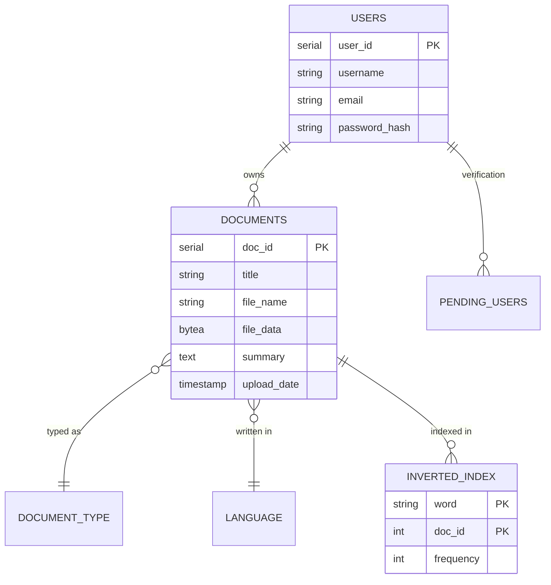

# SEARCHX ⚖️ | Legal Intelligence & Search Engine

**SearchX** is a production-grade Search Engine Indexing and Query Analytics system specifically designed for legal corpora. It enables legal professionals to upload, index, and perform high-relevance searches across complex legal documents including contracts, case summaries, and policies.

### 🌐 [Live Demo](https://search-x-five.vercel.app/) | ⚙️ [Backend API](https://searchx-backend.onrender.com)


## 🖼️ Visual Preview

### 🖥️ Dashboard & Search Execution
| Landing Page | Search Results (AI Summaries) |
| :---: | :---: |
|  |  |

| Analytics Overview | My Documents Management |
| :---: | :---: |
|  |  |

---

## 🚀 Core Features

### 🔍 Advanced Search Engine
- **Custom Inverted Index**: Built with high-speed keyword indexing for instant legal lookups.
- **Relevance Ranking**: Results are ranked based on term frequency and document metadata.
- **Multi-Format Support**: Native processing for PDF, DOCX, and TXT files.

### 🤖 AI-Powered Intelligence
- **Executive Summaries**: Integrates **Google Gemini AI** to automatically generate 3-sentence executive summaries for every legal document.
- **Contextual Understanding**: AI-driven metadata extraction for better document discoverability.

### 📊 Real-time Analytics & Dashboard
- **Query Logging**: Tracks and visualizes global search trends and top keywords.
- **Corpus Management**: Dedicated user dashboard to view, download, and manage your legal document index.

### ✉️ Production Email Delivery
- **SendGrid Integration**: Professional OTP verification flow using the SendGrid API to ensure reliable delivery in cloud environments.

---

## 💾 Database Architecture (PostgreSQL)

The system follows a relational schema optimized for search retrieval and term-frequency analytics.



---

## 🏗️ Architecture: The "Inverted Index"
The heart of SearchX is its custom-built indexing engine. When a document is uploaded:
1. **Extraction**: Text is extracted from PDF/DOCX and normalized (case-folding, punctuation removal).
2. **Tokenization**: NLTK-based stopword removal and Porter Stemming are performed.
3. **Database Indexing**: The engine maps each unique term to the document ID and records its frequency in the `INVERTED_INDEX` table.
4. **Search**: Queries are stemmed and matched against this pre-computed index, bypassing slow full-text scans.

---

## ⚙️ Installation & Setup

### Environment Variables
Configure the following in your `.env` or cloud provider:
- `DATABASE_URL`: Your PostgreSQL connection string.
- `GEMINI_API_KEY`: Google AI Studio API key.
- `SENDGRID_API_KEY`: SendGrid API key for emails.
- `SENDER_EMAIL`: Your verified SendGrid sender address.

### Local Development
1. **Backend**
   ```bash
   cd backend
   pip install -r requirements.txt
   python app.py
   ```
2. **Frontend**
   ```bash
   cd frontend
   npm install
   npm start
   ```

---

## 📄 License
Distributed under the MIT License. See `LICENSE` for more information.

---
**Developed as a DBMS Project to demonstrate advanced database indexing, AI integration, and production-ready cloud deployment.**
