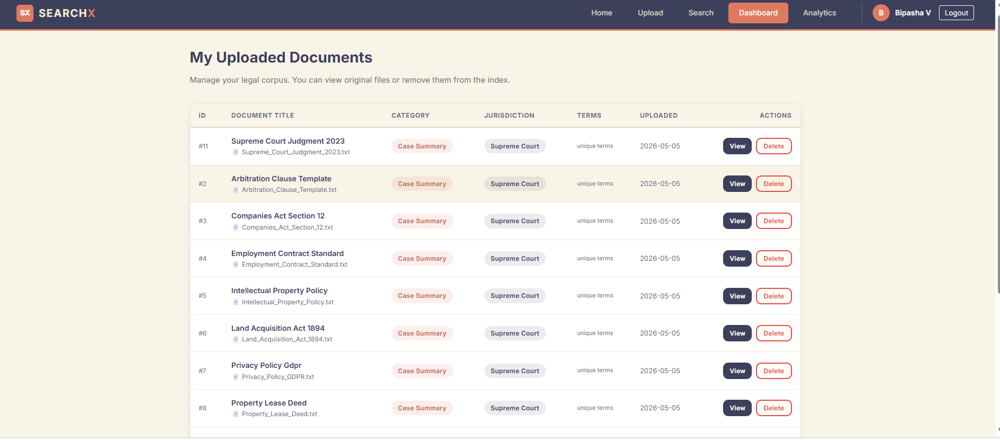
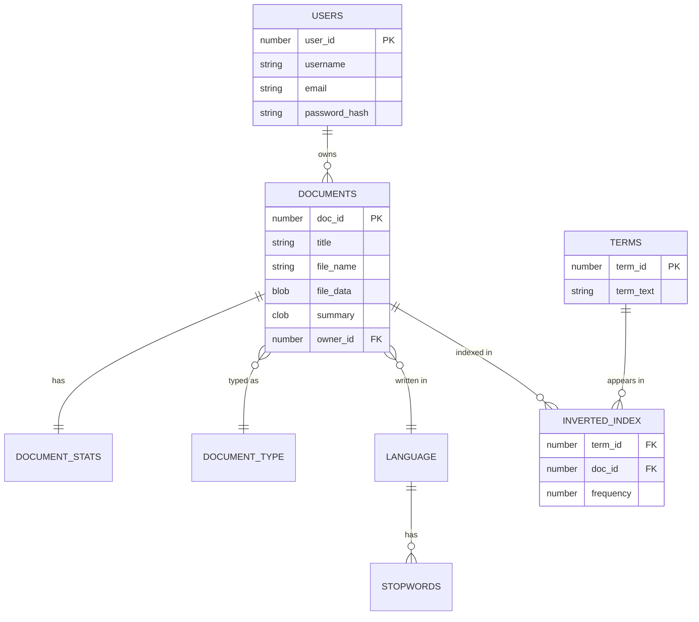

# SEARCHX ⚖️ | Legal Intelligence & Search Engine

**SearchX** is a production-grade Search Engine Indexing and Query Analytics system specifically designed for legal corpora. It enables legal professionals to upload, index, and perform high-relevance searches across complex legal documents including contracts, case summaries, and policies.

## 🖼️ Visual Preview

### 🖥️ Dashboard & Search Execution
| Landing Page | Search Results (AI Summaries) |
| :---: | :---: |
|  |  |

| Analytics Overview | My Documents Management |
| :---: | :---: |
|  |  |

### 📺 Project Demo Video

> *Click the badge above to watch the full project walkthrough.*

---

## 🚀 Core Features

### 🔍 Advanced Search Engine
- **Custom Inverted Index**: Built from the ground up using Oracle PL/SQL stored procedures for high-speed keyword lookups.
- **Relevance Ranking**: Results are ranked based on term frequency and document metadata.
- **Multi-Format Support**: Native processing for PDF, DOCX, and TXT files.

### 🤖 AI-Powered Intelligence
- **Executive Summaries**: Integrates **Google Gemini AI** to automatically generate 3-sentence executive summaries for every uploaded document.
- **Metadata Extraction**: Automatic calculation of document length and unique term density.

### 📊 Real-time Analytics
- **Query Logging**: Tracks and visualizes global search trends and top keywords.
- **Document Insights**: Real-time statistics on your legal corpus, including total terms indexed and jurisdiction distribution.

---

## 💾 Database Architecture (Oracle 11g)

The system follows a relational schema optimized for search retrieval and term-frequency analytics.

---

## 🏗️ Architecture: The "Inverted Index"
The heart of SearchX is its custom-built indexing engine. When a document is uploaded:
1. **Extraction**: Text is extracted and normalized (case-folding, punctuation removal).
2. **Tokenization**: NLTK-based stopword removal is performed.
3. **Database Indexing**: A stored procedure (`PROC_INDEX_TERM`) maps each unique term to the document ID and records its frequency in the `INVERTED_INDEX` table.
4. **Search**: Queries are stemmed and matched against this pre-computed index, bypassing slow full-text scans.

---

## ⚙️ Installation & Setup

### Backend
1. `cd backend`
2. `pip install -r requirements.txt`
3. Configure your Oracle connection and AI keys in `.env`.
4. `python app.py`

### Frontend
1. `cd frontend`
2. `npm install`
3. `npm start`

---

## 📄 License
Distributed under the MIT License. See `LICENSE` for more information.

---
**Developed as a DBMS Project to demonstrate advanced database indexing and AI integration.**
